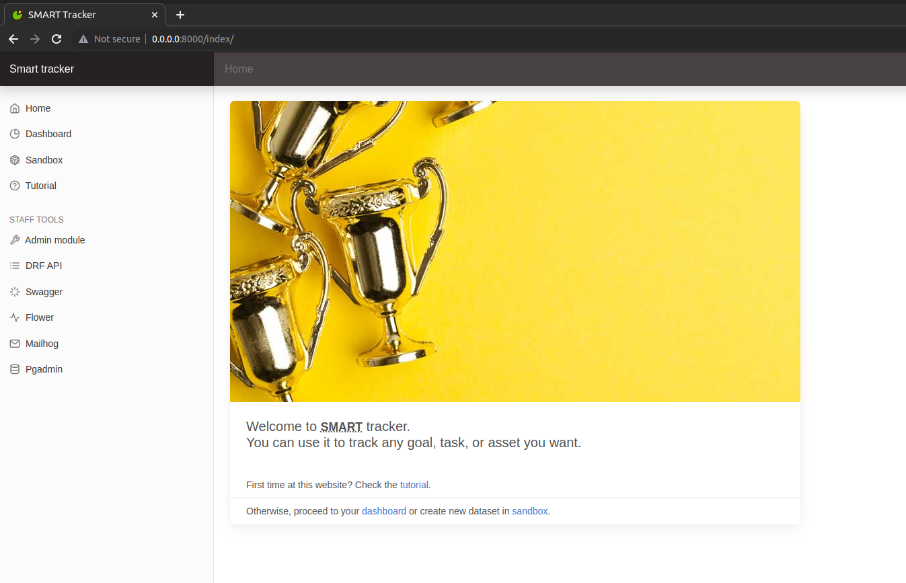
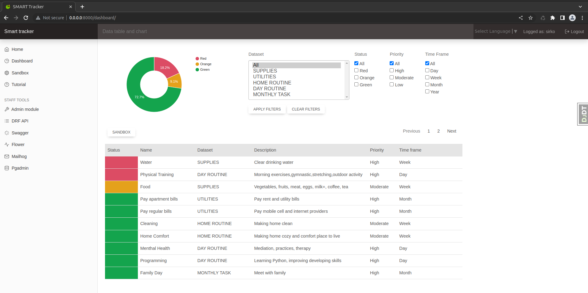
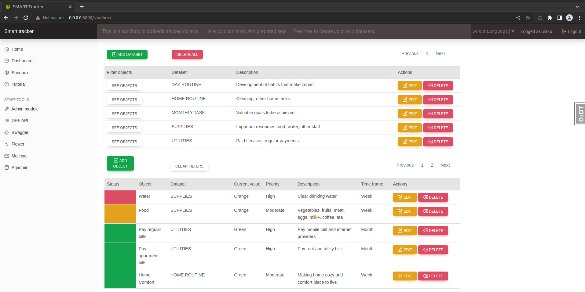
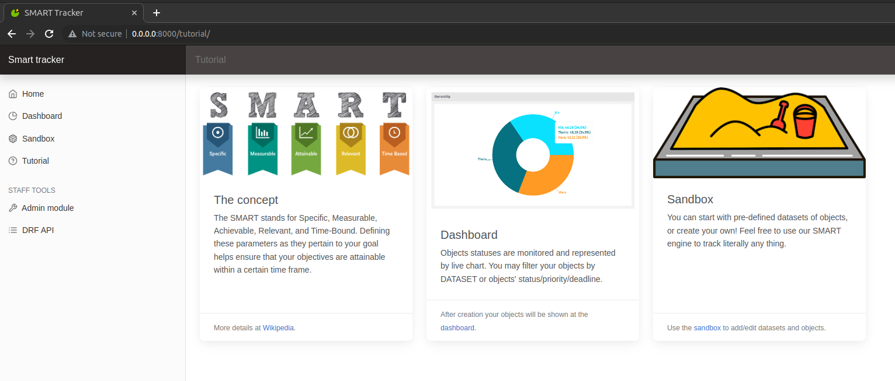
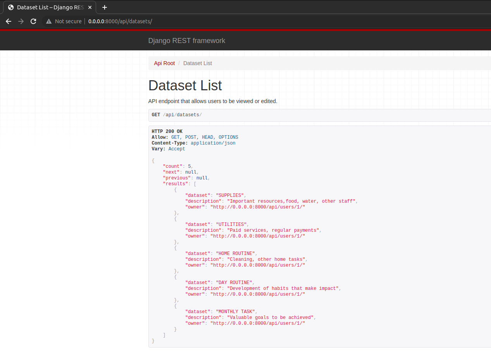
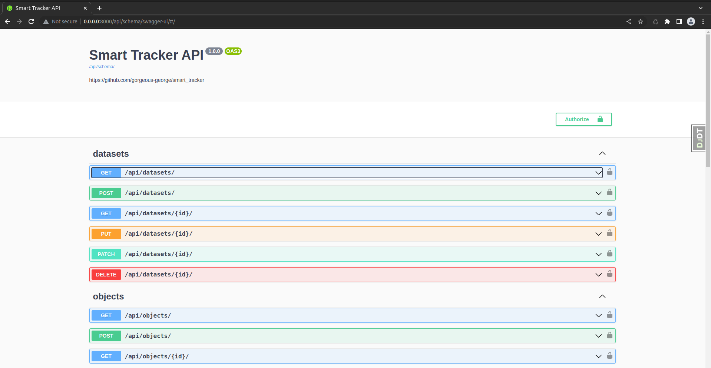
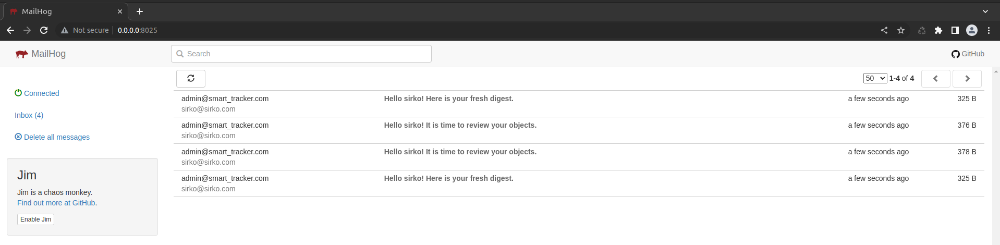
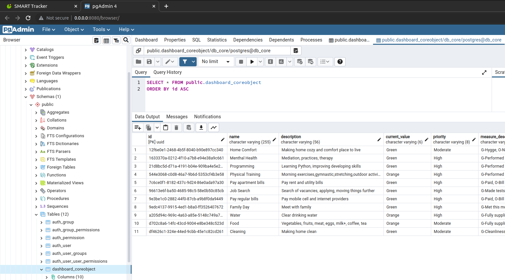

# Hello stranger! Here is a SMART tracker of any thing

SMART Tracker engine provides user with the following features:
1. Create, edit, delete the datasets containing objects/tasks/goals/resources.
2. Monitor the fulfillment/availability of the objects by descriptive dashboard, filters, and interactive chart.
3. Receive email notifications and summary reports.

Additional features:
- Authentication/Authorization
- User permissions (currently in development)
- Interactive JQuery/Ajax forms
- REST API returning users/datasets/objects, swagger/redoc schemas
- Celery/Redis, Flower
- Redis Cache
- Pgadmin
- Mailhog

## App description

<details>

- The SMART stands for Specific, Measurable, Achievable, Relevant, and Time-Bound. Defining these parameters as they 
pertain to your goal helps ensure that your objectives are attainable within a certain time frame.

- By default, we provide you with starter pack of resources/tasks you need to keep eye on to have your house/apartment 
supplied, cleaned and paid. Each status is monitored and represented by chart.

- You can start with pre-defined datasets, or create your own! Feel free to use our SMART engine to track literally 
any thing.

</details>

## Common logic

<details>

- User receives a short tutorial describing SMART concept and main application modules: SANDBOX and DASHBOARD.
- SMART concept is hard-coded to COREOBJECT model, so that each object has appropriate settings (current value, 
priority, measure, time frame, responsible).
- SANDBOX is used to create/edit/delete datasets and related objects. 
- Each object would have one of three statuses based on simple pattern "Red-Orange-Green". This can be interpreted as 
"Absent-Running low-Available" or "Not done-In process-Performed" and so on. Each object has its own level of priority 
and current value set by user, so that after object creation/update the application sets status of the object comparing 
current value with the priority. It is hard-coded by functional view at SANDBOX. 
- SANDBOX page has custom filters (SEE OBJECTS, SHOW ALL OBJECTS). It is designed as jQuery/Ajax + JS + custom 
functional views.
- SANDBOX page has buttons to Create, Edit and Delete datasets and objects. It is designed appropriately as modals +
ModelForms + jQuery/Ajax + JS + custom functional views returning JSON + HTML includes

- DASHBOARD is used to see the current status of the objects via data table and chart.
- DASHBOARD page has custom interactive filters by dataset, status, priority and timeframe. It is designed as custom 
django form + jQuery/Ajax + JS + custom functional views returning JSON + HTML includes.
- DASHBOARD has Pie Chart that is re-drawn appropriately to filter applied. It is designed as jQuery/Ajax + JS + custom 
functional views returning JSON + HTML includes

</details>

## Technology stack

- Python
- Docker-Compose
- Django
- jQuery/Ajax
- MDBootstrap
- HTML/CSS/JS
- Django Rest Framework
- drf-spectacular
- PostgreSQL
- pgadmin
- Celery
- Redis
- Flower
- Mailhog

## Quick start

1.Add ".core.env" file to the project's root directory:

<details>

#### tracker_core
- DJANGO_SECRET_KEY=
- DJANGO_SETTINGS_MODULE=
- PYTHONUNBUFFERED=

- DB_NAME=
- DB_USER=
- DB_PASSWORD=
- DB_HOST=
- DB_PORT=

#### db_core
- POSTGRES_USER=
- POSTGRES_PASSWORD=
- POSTGRES_DB=

#### pgadmin

- PGADMIN_DEFAULT_EMAIL= 
- PGADMIN_DEFAULT_PASSWORD=

</details>

2.Having Docker and Python installed use the following commands to build and run docker-compose.yml
```python
docker-compose build
docker-compose up
```
3.During the very first run of the app, apply migrations and create superuser directly within app's container
```python
sudo docker-compose exec core bash
./manage.py makemigrations
./manage.py migrate
./manage.py createsuperuser
```
4.SMART Tracker is available at http://0.0.0.0:8000/

## Screenshots










