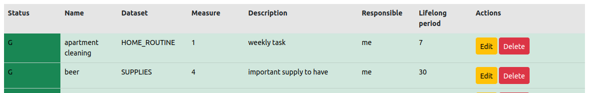

***
### 1. bug-0001 Priority_LOW Status_RESOLVED - Feather icon is missed after ajax GET request

### BUG DESCRIPTION
after submitting the modal form, the icons <span data-feather="edit" and "delete" are not rendered, and consequently are not shown on the website. 

### ROOT CAUSE
after ajax request the table body was re-rendered using html includes.
Feather icons were not converted to SVG icons appropriately and remained just as html 
tags.

### RESOLUTION
added to html includes the following script: feather.replace() that 
converts all feather icons to SVG.

<details>
  <summary>Details</summary>

- http://127.0.0.1:8000/dashboard/
- This bug affects the 'Delete' button as well.
- 
- 
- 

- dataset_objects.js
```js
  var saveForm = function () {
    var form = $(this);
    $.ajax({
      url: form.attr("action"),
      data: form.serialize(),
      type: form.attr("method"),
      dataType: 'json',
      success: function (data) {
        if (data.form_is_valid) {
          $("#coreobject-table tbody").html(data.html_coreobject_list);
          $("#modal-coreobject").modal("hide");
        }
        else {
          $("#modal-coreobject .modal-content").html(data.html_form);
        }
      }
    });
    return false;
  };
  
  
$("#modal-coreobject").on("submit", ".js-coreobject-update-form", saveForm);
```
- html template
```html
<button type="button"
    class="btn btn-warning btn-sm js-update-coreobject"
    data-url="">
    <span data-feather="edit" class="align-text-bottom"></span>
    Edit
</button>
```
- view
```python
def save_coreobject_form(request, form, template_name):
    data = dict()
    if request.method == 'POST':
        if form.is_valid():
            form.save()
            data['form_is_valid'] = True
            page_obj = coreobject_paginator(request)
            data['html_coreobject_list'] = render_to_string('includes/partial_coreobject_list.html', {
                'page_obj': page_obj,
            })
        else:
            data['form_is_valid'] = False
    context = {'form': form}
    data['html_form'] = render_to_string(template_name, context, request=request)
    return JsonResponse(data)
```
</details>

***
### 2. bug-0002 Priority-LOW Status_OPEN - dataset objects are not updated after dataset deletion
### BUG DESCRIPTION
If user deletes a dataset having related objects, these objects should be deleted as well. 
There is a function that obtained updated list of objects and return it to browser to re-render objects table.
By unknown reason the object table is not updated SOMETIMES, i.e. it can be updated appropriately one time, 
and be not updated by next try. See Screenshots 1,2,3 below. 

Objects table can be also partly updated, i.e. the object table is still not updated 
but objects' dataset name is cleared. See Screenshots 4,5,6 below. 

### ROOT CAUSE
It was found that object table's data is cached by browser.

### RESOLUTION
Temporary solution is to clear browser cache manually.

<details>
  <summary>Details</summary>

- http://127.0.0.1:8000/sandbox/ 
- Objects table is not updated:
- 
- 
- 
- Objects table is partly updated:
- 
- 
- 

- dataset.js
```js
  var reload_dataset_objects_table = function () {
    $.ajax({
      url: 'objects/reload/',
      type: 'get',
      dataType: 'json',
      success: function (data) {
        $("#dataset-object-table tbody").html(data.html_dataset_object_list);
      }
    });
  };

  // Delete coreobject
  ...
  $("#modal-sandbox").on("submit", ".js-dataset-delete-form", reload_dataset_objects_table);
  
```
- html template
```html

    <tr>
        
            <td class="bg-success">{{ coreobject.status }}</td>
        
            <td class="bg-warning">{{ coreobject.status }}</td>
        
            <td class="bg-danger">{{ coreobject.status }}</td>
        
            <td>{{ coreobject.status }}</td>
        
        <td>{{ coreobject.name }}</td>
        <td>{{ coreobject.dataset }}</td>
        <td>{{ coreobject.measure }} {{ coreobject.measure_unit }}</td>
        <td>{{ coreobject.description }}</td>
        <td>{{ coreobject.responsible }}</td>
        <td>{{ coreobject.lifelong_period }}</td>
        <td>
            <button type="button"
                    class="btn btn-warning btn-sm js-update-dataset-object"
                    data-url="">
                    <span data-feather="edit" class="align-text-bottom"></span>
                    Edit
            </button>
            <button type="button"
                    class="btn btn-danger btn-sm js-delete-dataset-object"
                    data-url="">
                    <span data-feather="delete" class="align-text-bottom"></span>
                    Delete
            </button>
        </td>
    </tr>

    <tr>
        <td colspan="8" class="text-center bg-warning">
            There are no objects.
        </td>
    </tr>

```
- view
```python
def reload_dataset_object_table(request):
    """
    If user updates/deletes a dataset having related objects, these objects should be updated/deleted as well.
    This function returns updated list of dataset objects to reload objects table.
    """
    data = dict()
    object_list = CoreObject.objects.all()
    paginated_object_list = sandbox_paginator(request, object_list)
    data['html_dataset_object_list'] = render_to_string('includes/partial_dataset_object_list.html', {
        'paginated_object_list': paginated_object_list,
    })
    return JsonResponse(data)
```
</details>

***
### 3. bug-0003 Status_OPEN Priority_LOW - Objects table is reloaded ignoring cases when only one dataset is selected
### BUG DESCRIPTION
At Sandbox after dataset's creation/update/deletion, objects table is reloaded ignoring filters set at the 
dataset table, for example when only one dataset is selected, it is expected to see objects related to this dataset only 

### ROOT CAUSE
TBD

### RESOLUTION
In case "Show objects" button is_activated AND the dataset is being updated/deleted, need to reload/return/show objects 
of this dataset only, such as it has shown before dataset has been updating/deleting

<details>
  <summary>Details</summary>

- 
- 
- 
- 

- 
```js

```
- html template
```html

```
- view
```python

```
</details>

***
### 4. bug-0004 Status_OPEN Priority_LOW - Button "Show objects" doesn't work after dataset updates/delete. Need to reload the whole page
### BUG DESCRIPTION
TBD

### ROOT CAUSE
TBD

### RESOLUTION
TBD

<details>
  <summary>Details</summary>

- 
- 
- 
- 

- 
```js

```
- html template
```html

```
- view
```python

```
</details>

***
### 5. bug-0005 Priority_CRITICAL Status_OPEN - excessive DB queries at core pages 
### BUG DESCRIPTION
Insufficient SQL queries produce similar SQL requests to the database and decrease web-pages loading time 

### ROOT CAUSE
Insufficient SQL queries - see details below.

### RESOLUTION
Temporary resolution: set paginator limit up to 5 objects per page. 
So that there always will be not more than 5 SQL queries to the DB per one page.

Planned resolution steps:
1. to analyse looped consequences of the duplicated SQL requests
2. to fix appropriate DB queries and/or functions at appropriate views
3. as alternative way - to implement cache methods 

<details>
  <summary>Details</summary>

- Coreobject model has ForeignKey to Dataset model. While rendering coreobject table, the coreobject's field
"dataset" is requested for each coreobject. It means 1 SQL query for each coreobject in the table. 

- 
- 
- 

```js
```
- html template
```html
see Screenshot #1
```
- dashboard.views
```python
def coreobject_list(request):
    coreobjects = CoreObject.objects.all()
    paginated_obj_list = coreobject_paginator(request, coreobjects)
    chart_data = get_data_for_chart(coreobjects)
    unique_dataset_names = Dataset.objects.all()
    return render(request, 'dashboard.html', {
        'paginated_obj_list': paginated_obj_list,
        'chart_data': chart_data,
        'unique_dataset_names': unique_dataset_names,
    })
```
- sandbox.views
```python
def sandbox_index(request):
    paginated_dataset_list = get_dataset_list(request)
    paginated_object_list = get_object_list(request)
    return render(request, 'sandbox.html', {
        'paginated_dataset_list': paginated_dataset_list,
        'paginated_object_list': paginated_object_list,
    },)
```

</details>

***
### 6. bug-0006 Status_OPEN Priority_LOW - 
### BUG DESCRIPTION
TBD

### ROOT CAUSE
TBD

### RESOLUTION
TBD

<details>
  <summary>Details</summary>

- 
- 
- 
- 

- 
```js

```
- html template
```html

```
- view
```python

```
</details>

***